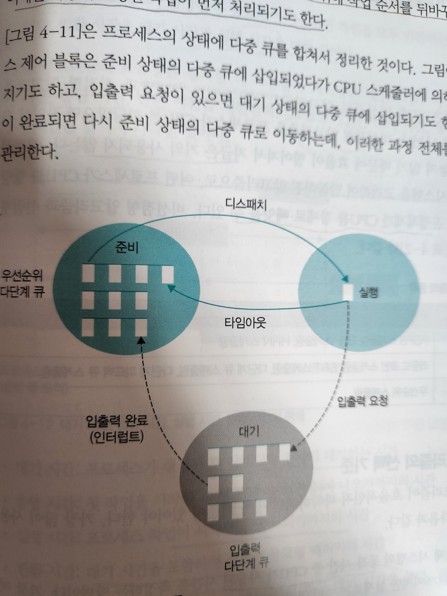
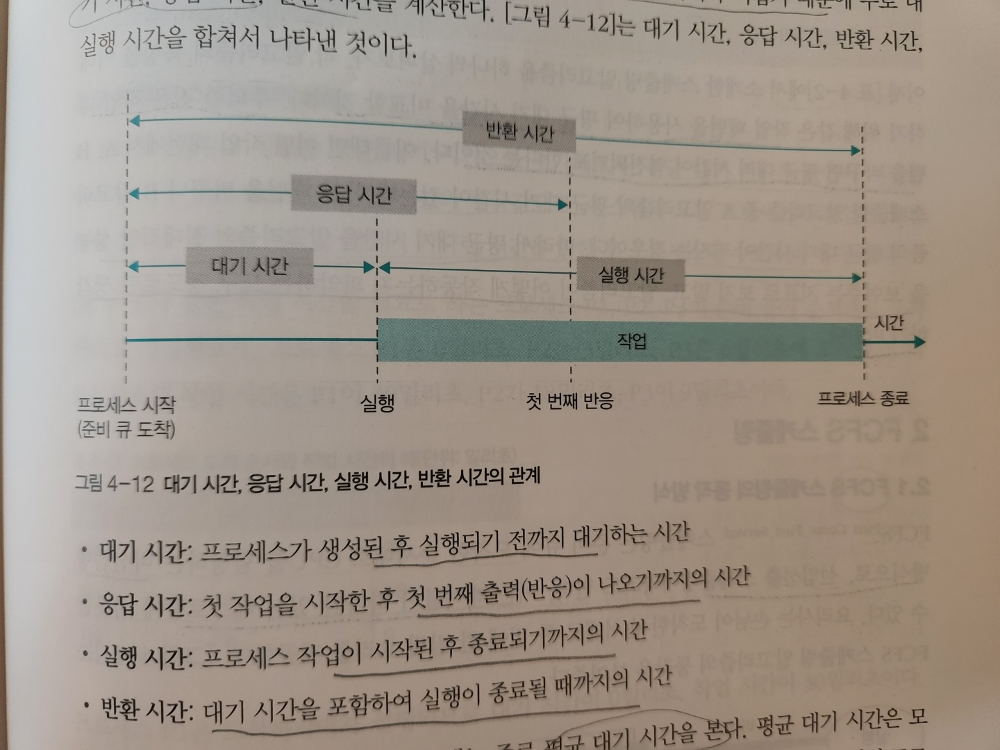

# CPU Scheduling

1. [Intro and Recap](#Intro-and-Recap)
2. [CPU scheduling consideration](#CPU-scheduling-consideration)
3. [Multiple queue](#Multiple-queue)
4. [Scheduling algorithm](#Scheduling-algorithm)
5. [Interrupt handling](#Interrupt-handling)

# Intro and Recap

1. Recap
    ```
    Q: So what is a process lifecycle?
    A: Process lifecycle is steps process goes through from creation to termination.
       it consists of create, ready, running, blocking, and terminate status
   ``` 

2. What is CPU scheduler?
    - `Part of OS that controls CPU allocation based on context(i.e., status of other processes, allocattion of CPU and resources)`

3. In real life, what is equivalent to CPU Scheduling?
    - Restaurant manager
        - manages reservations, change cooking order, respond to customer

4. Levels of scheduling
    - High level
        - job scheduling, or admission scheduling
        - `High level scheduling determines total number of works`
        - if there are too many jobs running, system overloaded!
            - Like restaurant accepting too many customers despite ths number of seats
        - `When job requests come, scheduler decide whether to accept or decline, based on context`
    - Mid level
        - Between high and low level
        - `Act as a buffer`
        - `Even though high level system controls total number of process, sometimes it does not work idealy`
        - `By limiting the number of active process, this prevents system overloads`
            - Using suspend and active
    - Low level
        - short-term scheduling
        - `Determines which process needs to take CPU, and which to set as blocking status and as such`
            - This means, `Dealing with process status`
    - 

5. Purpose of scheduling
    - Fairness
        - Every process will be equally allocated
    - Efficiency
        - No down-time
    - Stability
        - allocate resource based on priority, protect system from malfunctioning process
    - Scalability
        - Scalable when number of process increases
    - Response time
        - Respond within designated time
    - Prevent infinite postpone

# CPU scheduling consideration

`How CPU scheduler allocate CPU resources to process primarily?`

### Preemptive vs non-preemptive

`Can OS take over CPU or not?`

1. Preemptive scheduling
    - `OS can take CPU from a running process if it has to`
        - How? `through intterrupt`
    - Can be wasteful in context switch and other additional work perspective
    - `However, since one process can take CPU forever, preemptive suits for time-sharing system`
2. Non-preemptive scheduling
    - `No one can take CPU from running process unless it terminates or blocks itself`
    - Can be efficient since less context switching or other additional work
    - `However, not efficient since other process has to wait`

### Process Priority

- Every process has its own priority
    - it's like normal customers vs customers with reservation
- Higher priority = frequent occupation of CPU
    - `Kernel process has higher priority than normal process`
- `Priority is present in PCB`

### Which process has higher priority, CPU bound vs I/O bound process?

- Process goes to various stages(creation, ready, running, blocking, termination)
- running status: a process actually taking CPU and execute computation -> CPU bound
- blocking status: request I/O and wait for its completion -> I/O bound

> If CPU bound has higher priority, it is going to take CPU more frequently.
>
> thus, I/O bound process has higher priority

### Which process has higher priority, foreground vs background process?

- foreground process
    - a process that user actively interacts with
    - has I/O operation
- background process
    - a process that user does not actively interact with
    - downloading, zipping file
- `Foreground process has higher priority than background process`

# Multiple queue

### Multiple queue in ready status

- `What if number of process are wait for allocation of CPU without order?`
    - CPU has to walk through every process to allocate CPU based on priority

- `It would be easier for scheduler to allocate CPU if processes are sorted by priority`
    - `Yes, have multiple queue based on priority!!`
    - **# of queue, allocating CPU depends on scheduling algorithm**

- How is priority of a process set?
    - static priority
        - Does not change once set
        - Hard to keep up with change
    - dynamic priority
        - Dynamically change its priority
        - Easy to keep up with change, but hard to implement
        - priority inversion

### Multiple queue in blocking status

- `Multiple queue based on same I/O work`
    - Queue based on HDD, LAN, CD-ROM

### Multiple queue from ready status vs blocking status

- In ready status, `allocate CPU to process one by one`
- In blocking status, `Take multiple PCB and move to ready status, if multiple I/O work finish`



# Scheduling algorithm

- preemptive and non-preemptive
- preemptive algorithm is mostly used
    - Again, it is best for time-sharing system

## How to measure efficiency of scheduling algorithm?

1. CPU utilization
    - `time CPU used / total time`
    - The higher number is, the more efficient
    - hard to measure
2. Throughput
    - `number of processes that finish tasks per unit time / total time`
    - The higher number is, the more efficient
    - hard to measure
3. Waiting time
    - time it takes between request and actual execution
    - `start time - request time`
    - shorter the better
4. Response time
    - How fast it respond to client request
5. Turnaround time
    - time between process creation and termination

- Since it's hard to measure algorithm's efficiency, people tend to calculate `average waiting time`
    - This can vary with work pattern
      

# Non-Preemptive Scheduling Algorithms

## FCFS(First Come First Serve)

- FIFO scheduling
- Like restaurant with only one table
- `Since only one queue, all process has same priority`
- Used in batch system
- Simple & fair, but with long-running task, avg waiting time could become longer
    - convoy effect

## SJF(Shortest Job First)

- `Allocate CPU to process with the shortest running time`
- an order changes if it finds a process which is shorter than upcoming process
- Better than FCFS scheduling, But
    - `How does OS predict exact termination time of processes of modern computers?`
        - Was easy to predict with batch system
    - Fairness problem
        - `What if processes with shorter time keeps being added to queue?? : Starvation`

## HRN(Highest Response Ratio Next)

- non-preemptive scheduling to solve starvation noticed in SJF
- schedule based on priority = (Waiting time + Running time) / Running time
- Better than SJF, but still violates Fairness

# Preemptive Scheduling Algorithm

## Round Robin(RR)

- `circular`
- `allocate CPU for time slice`
    - When it's not done, that task will be added to the tail of a queue
- No priority applied
- Similar to FCFS, but has time slice
    - minimized convoy effect
- `Has frequent context switch`
    - right time slicing is needed since Round robin has frequent context switch
- Setting bigger time slice
    - less frequent context switch, but almost identical to FCFS
- Setting smaller time slice
    - too much frequent context switch

## SRT(Shortest Remaining Time)

- SJF + RR
- Use RR in general case(after time slice -> send it back to tail)
    - However, when allocating CPU, select process with the shortest remaining time
- Has to calculate each process's remaining time + context switch

# Interrupt handling