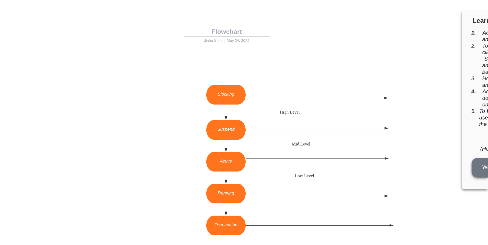

# CPU Scheduling

1. [Intro and Recap](#Intro-and-Recap)
2. [CPU scheduling consideration](#CPU-scheduling-consideration)
3. [Multiple queue](#Multiple-queue)
4. [Scheduling algorithm](#Scheduling-algorithm)
5. [Interrupt handling](#Interrupt-handling)

---

# Intro and Recap

1. Recap
    ```
    Q: So what was a process lifecycle?
    A: Process lifecycle consists of create, ready, running, blocking 
       and terminate status
   ``` 

2. What is CPU scheduler?
    - `It's main job is to control status of process by considering context(i.e., status of other processes, allocattion of CPU and resources)`

3. In real life, what is equivalent to CPU Scheduling?
    - Restaurant manager
        - manages reservations, change cooking order, respond to customer

4. Levels of scheduling
    - High level
        - job scheduling, or admission scheduling
        - `High level scheduling determines total number of works`
        - if there are too many jobs running, system overloaded!
            - Like restaurant accepting too many customers despite ths number of seats
        - `When job requests come, scheduler decide whether to accept or decline, based on circumstances`
    - Mid level
        - Between high and low level
        - `Act as a buffer`
        - `Even though high level system controls total number of process, sometimes it does not work idealy`
         - By limiting the number of active process, this prevents system overloads
            - Using suspend and active
    - Low level
        - short-term scheduling
        - `Determines which process needs to take CPU, and which to set as blocking status amd as such`
            - This means, `Dealing with process status`
   - 

5. Purpose of scheduling
   - Fairness
      - Every process will be equally allocated
   - Effectiveness
      - No down-time
   - Stability
      - allocate resource based on priority, protect system from malfunctioning process
   - Scalability
      - Scalable when number of process increases
   - Response time
      - Respond within designated time  
   - Prevent infinite postpone
      - Self-explanatory

# CPU scheduling consideration

# Multiple queue

# Scheduling algorithm

# Interrupt handling