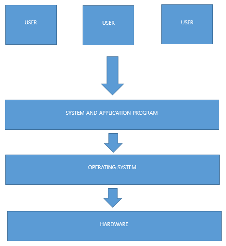
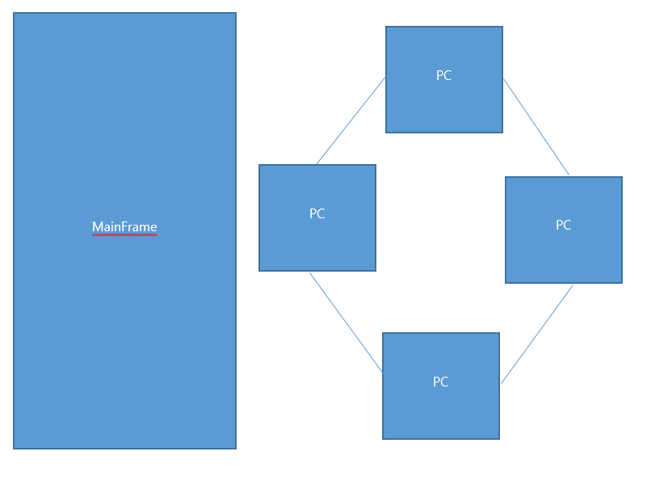
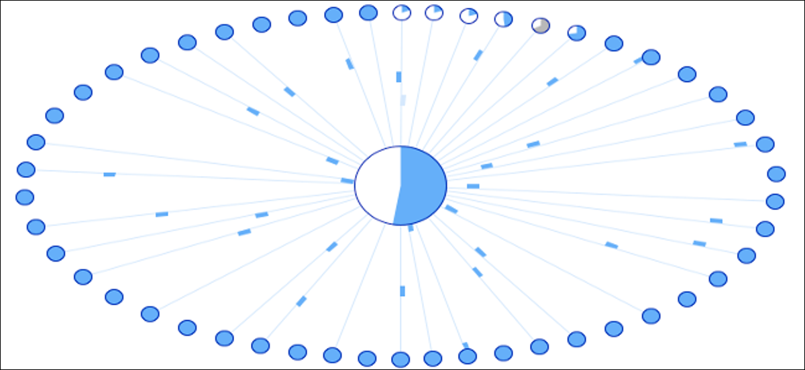
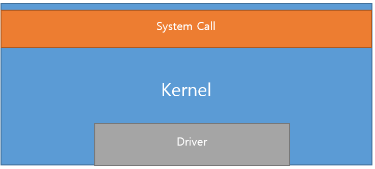

# Section
1. [Introduction of Operating System](#Introduction-of-Operating-System)

2. [Brief History of Operating System](#Brief-History-of-Operating-System)

3. [Structure of Operating System](#Structure-of-Operating-System)

4. [Types of OS and History](#Types-of-OS-and-History)

---

# Introduction of Operating System

- Operating systems that we know : Windows, Mac OS, Linux, iOS, Android...
  
  
  
  

- OS in everywhere
  - SmartPhone, TV, PC, Laptop, Watch

- Necessity of OS
  - `In early days, computer did not require any rules` because computer during those days 
    `only performed designated computation`
  - As computer and its components advance and `perform additional complex things, computer start to need sets of rules to
  manage itself, and this is where OS comes into play`
      - Consider the world without laws, it must be chaotic world! :smiling_imp: :smiling_imp: :smiling_imp:
  - `Computer works without OS, but We have to deal with every thing by ourselves`, also
    - Without OS - Impossible to add additional functionalities, only used for initial purpose
    - Example: Simple phone VS SmartPhone

- What is OS
  - `A Software` that resides in Computer or any other machines, manages resources and application programs
  
  - `A Software` that sits in `between Users and a Hardware`, let users `utilize hardware without knowing the details
  of a hardware with self-defined sets of rules`
    
  - `Compiler` When programmers write an application, they use programming language which human can understand.
  Later, with help of Compiler, code is converted into something called `machine code` which computer can
    understand, and computer executes it.
    
  - `Waiter`: Waiter at restaurant takes orders from customers(`Users`) :point_right: takes orders to the kitchen 
    :point_right: chef take orders and start cooking(`Hardware`). Think about customers going into the kitchen 
    and start cooking by themselves :point_right: Nightmare!!
  
  - `Administrator`: If computer only executes one thing, There's no need to have OS. However, Since computer executes
  more than one process(think of it as a program such as word, chrome, `for now`) with limited number 
    of resources(CPU, memory), Computer needs someone to manage this: Operating System.
    
    

- Role of Operating System
  - Resource Management
    - We do many things with computer at a time(even at this moment, I am listening music on YouTube, jetbrains is on
       and 10 separate chrome pages are opened) with limited resources.
    - Operating System's role is to `let user use computers seamlessly by allocating resources effectively, efficiently`
  - Secure Resource
    - From `Waiter` example from above, it is going to be such a mess if customers(Process) cook by themselves at a restaurant
    - `By protecting(or hiding) kitchen(resources), it prevents processes from abnormal activities` 
  - Provide Hardware Interface
    - How are we going to use resources, if OS secure resources and manage resources?
    - `By providing hardware interfaces, OS still manages and secure resources, while letting users utilize resources
      in predefined way without knowing details of it` 
    - `Easy to add/remove resources - Plug & Play`  
  - Provide User Interface
    - Graphical User Interface
    - `Let users use OS easily`

  
- Goal of Operating System
  - Resource Management :point_right::point_right: `Efficiency`
  - Securing Resource :point_right::point_right:  `Safety`
  - Providing Hardware Interface  :point_right::point_right: `Expandability`
  - Provide User Interface  :point_right::point_right: `Convenience`

# Brief History of Operating System

#### 1. Early stage(1940s)
- Eniac
  - Used to calculate missile trajectory
  - Used vacuum tube(on-off, later for computer using binary digits)
  - Logic gate is made with vacuum tubes connected by wires(hard wiring) 
  - No OS

#### 2. Batch System(1950s)
- Vacuum tube to IC(integrated circuit)
- IC? A chip that try to minimize the size of logic gate that is made with vacuum tube and wires
- Had CPU and memory, but no output devices
- OMR, line printer
- Able to change program (like modern computer)
- Input data and program at the same time
- `One job at a time, all jobs at once, cannot change data while program is running : Batch system`
  

#### 3. Interactive System(1960s)
- Advent of keyboard and monitor
- No need to input data and program at the same time
- Able to see results and change the data in the middle of program
- Able to create various types of applications
- CPU bound job: Batch system, mostly for calculation
- I/O bound job: Interactive system, mostly for I/O work

#### 4. Time Sharing System(late 1960s)
- Still expensive and performed one job at a time
- `Advent of multiprogramming(doing one job at a time is such a waste)`
  - Multiprogramming? `perform more than one tasks with a single CPU to increase efficiency`
- How Multiprogramming Works? - `Time Sharing`
  - CPU will allow `each job to use CPU for a very short amount of time`
  - job A for 0.1s and then B for 0.1s, and C for 0.1s, and A after 0.3s -> over and over
  - `If this time allocation is repeated very fast, it looks like A,B,C are working simultaneously`
  - `Definition: Process each job little by little, a.k.a multitasking`
  - Amount of time allocated to each process: time slice
  - Disadvantage of time sharing
    - Need additional work to let multitasking
    - No guarantee in exact finish time if there are lots of jobs processing at the same time
      - As a result, computer uses real-time system to guarantee is exact finish time
- Level of multiprogramming (degree of multiprogramming)
  - How many programs are running at the same time? (batch system: 1)
  - Multitasking facilitate multi-user system `Many people use computer at the same time`

#### 5. Distributed System (late 1970s)
- Advent of affordable PC, and Internet
- Rapid advancement in software, especially in OS
- Before: Used big and expensive computer(MainFrame) to deal with complex calculation and data
- After PC and Internet: `Connect small and cheap PCs together` to work and function like MainFrame
  :point_right::point_right: `Distributed System`
  
  

- Use PCs to calculate or process complex job and share its result via network

#### 6. Client-Server System(1990s ~ present)

- Client that requests
- Server that process requests
- Web browser
- Daemon program
  - Program that runs as a background process, keeps running while computer is on
  - Server should keep running to handle client requests
  - Computer with daemon :point_right: server
  - Apache Tomcat, IIS
  

#### 7. P2P(early 2000s ~ present)

- Problem with Client-Server
  - What if Server computer is overloading?
  - Web pages are just few KB, but music or streaming takes more than that 

- Solution to ease server overloading?
  - What if we `as PCs are connected directly without server`?
  - Let server do the searching or things that may not cause overload, while `each of us(peer) is
  connected to each other when sending files or doing some heavy work.`
  - Example
    - `Messenger`
        - Millions of people sending messages to each other, sending various types of files
      through server? Big no!
        - Rather, Server does authentication and authorization, and let heavy work done between
      peers
          
    - `File Sharing`
      - Torrent
      - For downloading or sending small size of files between peer to peer, you can download again
  when the counterpart shuts off his/her computer.
      - What if you are downloading hundreds of MB?
        - `download small chunk of file from more than one user!`
        - When one shuts off or has problem with computer :point_right: download from others
        
        
        
        <figcaption align = "center"><b>Bittorrent swarm, image by Chris Hoffman</b>
           
          <a href="https://www.howtogeek.com/141257/htg-explains-how-does-bittorrent-work/">Link to a Post</a>
           </figcaption>

  
  
#### Modern Computing Environment(early 2000s ~ present)

- **Grid Computing**
  - Connect computers that are geographically distributed by networks to perform joint tasks
  - Subset of distributed computing(connected by Ethernet or Internet)
  - Subset of parallel computing

- **Cloud Computing**
  - Grid Computing + Saas(Use software when needed, pay for what you used)
  - User can use software and hardware wherever they want
  - Cost-effective
    - Only care about what we want to do, Service providers take care of the rest

      
  
  
  
  <figcaption align = "center"><b>Image of Cloud Computing</b>
   
  <a href="https://www.pcmag.com/news/what-is-cloud-computing">Link to a Post</a>
  </figcaption>

- **Internet of Things**
  - Connect objects with Internet through sensors and chips
  - We can turn off lights, let laundry wash clothes remotely

# Structure of Operating System

### In a broad sense, OS = `Interface + Kernel`
  - `Interface`
    - Close to user application, receive and send data from application and Kernel,
    notify it to user
    - GUI, shell, bash
    
  - `Kernel(Core Part)`
    - The most important part of OS that plays key roles like Process management, Memory management,
      Hardware managemen etc
    - `Like engine in a car`
    - `Performance of OS is very much depend on Kernel`
   
  - Simplified version of OS structure
    
      
  
  
  <figcaption align = "center"><b>OS structure</b>
   
  <a href="https://www.pcmag.com/news/what-is-cloud-computing">Link to a Post</a>
  </figcaption>

### Inside of Kernel
  
  
  
  - Inside of kernel, It contains `System Call` and `Driver`
    - System Call
      - Example of system call: `printf(), println( )`
      - `One of OS jobs is to protect and manage resources`
        - `OS protect and manage` resources(hardware) `by not letting users and applications have
          direct access to hardware(or resources)`
        - `How?` by Providing interface called `System Call`
          - Let users and applications `have indirect access` to protects and manage resources
        - Group of system resource related methods that Kernel provides
        - When accessing hardware, you or program must use system call
      - Think about when applications and users have direct access to resources,,,What would happen?
           
    - Driver(Device Driver)
      - Why needed?
        - There are lots of hardware attached to computer, and lots of variations in each
        - `OS to offer environment for every single types and variations of hardware?` `No`
        - Hardware developers know its characteristics of hardware they make better
      - Hardware developers make software that reflects characteristics of hardware,
        - Let it work when kernel starts
        - `This software is called Driver`
        - Kernel only contains basic I/O part
      - What is Driver?
        - Graphic Card, Printer driver that we install
        - `Interface between Kernel and Hardware`
      - Things to know about Driver
        - `Kernel have both direct or indirect access to Hardware`
          - Kernel has its own driver and driver that hardware maker provides
      

### Architecture of Kernel  
  - Jobs of Kernel
    - Process Management
    - Memory Management
    - File System Management
    - I/O Management
    - Inter-Process Communication(IPC)
    - ...
  - Jobs are connected systematically, and based on How these are implemented, Architecture is separated
into following types
  
  
- Monolithic Architecture
  - `Used in early stage`
  - `Everything inside one module`
  - MS-DOS
  - This is like coding everything in `main( )`
  - `Pros`
    - No communication overhead between jobs - implementations are in one module 
  - `Cons`
    - Hard to debug
    - Dependencies between system components
    - Failing in one function may cause failing in system
    - Hard to modify

- Layered Architecture

- Micro Architecture 

# Types of OS and History

# Link

[Image of Torrent](https://www.howtogeek.com/141257/htg-explains-how-does-bittorrent-work/)

[Image of Cloud Computing](https://www.pcmag.com/news/what-is-cloud-computing)

[Image of kernel](https://en.wikipedia.org/wiki/Kernel_(operating_system))

# Next

Go to [Chapter2. Computer and Performance Basic](../ch2.computer_and_performance)