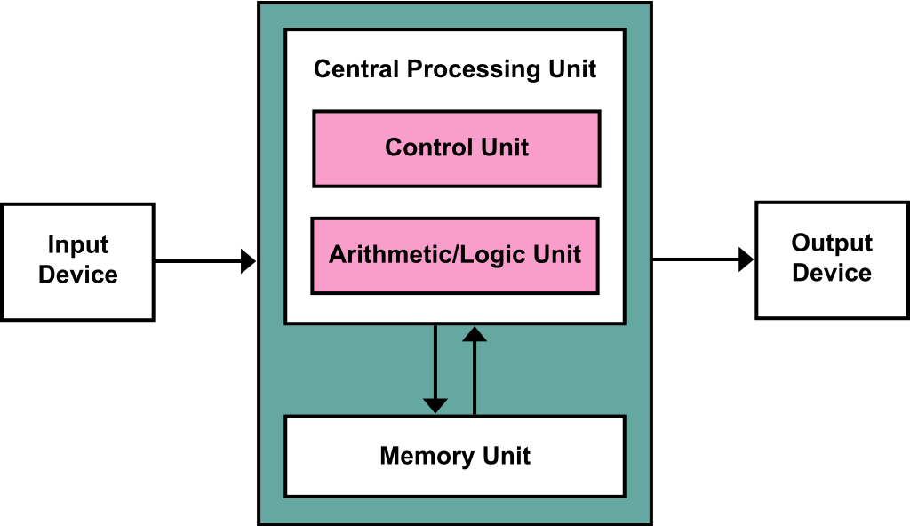
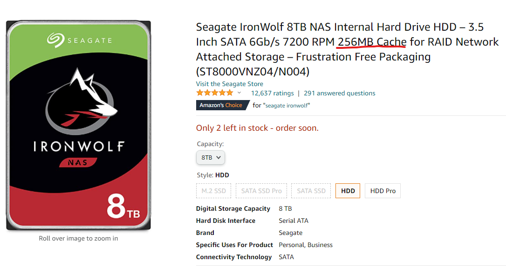

# Ch2. How OS works in general 

# Section

[Components of Computer](#Components)

[Von Neumann Architecture](#Von-Neumann-Architecture)

[CPU and Memory](#CPU-and-Memory)

[Performance boost technology](#Performance-boost-technology)

[Parallel Processing](#Parallel-Processing)

[Moore's law and Amdahl's law](#Moore's-law-and-Amdahl's-law)

# Components

- CPU, Main memory
- Keyboard, Mouse, Printer, Monitor, Hard-drive ...
- Main memory loses data when power goes off :point_right: need something to store permanently(Hard-drive, USB)
    - Main memory - first storage
    - Hard-drive or USB - second storage


- CPU and Memory
    - Human brain
    - Memory stores program and data, `divided into byte`

- I/O Devices
    - Input: Keyboard, mouse, scanner etc
    - Output: Speaker, Monitor, Printer
    - In the past, CPU calculates graphical calculation, but these days GPU does that

- Storage
    - Primary Storage & Second Storage
    - Primary storage is faster but expensive

- Main Board(motherboard)
    - All these pieces of hardware are installed on motherboard, and connected by `Bus`
    - What is `Bus`?
        - `Is a communication pathway that allows data to travel between different components`


- Some hardware spec-related terms
    - Clock
        - `Rhythm, Speed of CPU`
        - `CPU performs tasks in clock`
        - Clock produce certain thing called `Pulse, or Clock tick at regular interval`
        - Pieces of hardware are connected with Bus
            - Every time clock in main board sends clock tick, hardware receives and send data
    - Hz
        - `How many clock ticks in a second?`
        - Represents speed of clock occurrence in a second
        - 3.2 GHz = 3,400,000,000 clocks in a second
    - System bus(FSB - front-side bus)
        - `Bus between memory and peripherals`
        - If main board has 1,333MHz system bus whereas memory has 800MHz :point_right: main board works as 800MHz
    - Internal CPU bus(Back Side Bus)
        - Bus reside in inside of CPU
        - Speed of internal CPU bus is way faster than system bus
    - `How to deal with speed difference between System and Internal CPU bus?`

# Von Neumann Architecture



- Computers these days are made based on von Neumann Architecture
- Computer before Von Neumann Architecture,
    - Manually hard-wired everything to re-program
- It basically suggested Basic Structure of Computer,
    1. CPU(CU & ALU)
    2. Memory(Program memory & Data memory)
    3. I/O Device

    - Connected by bus
- `Leave the hardware, switch program by using memory and having program loaded on memory`
- A.k.a. `stored-program computer`: Instruction data and program data are stored in same memory
- Anytime we need calculation, we send program and data from memory to CPU and let CPU do the job
    - Order

    1. `Fetch` data, instruction from memory
        - Instruction fetch and data operation cannot occur at the same time(They share common bus)
            - Cause von Neumann bottleneck(performance issue)
    2. `Decode` instruction
    3. `Execute` instruction
    4. `Store` result

- Bottleneck?
    - Limited throughput between CPU and memory
        - `Data and program memory share same common bus`
        - `Can only access one of two classes of memory one at a time`
    - Solution?
        - Harvard Architecture
            - Set separate bus for each data and program memory
            - Cache...
- One instruction at a time?
    - Inefficient
    - Multiprogramming, Asynchronous...


- Von Neumann Architecture and Restaurant?
    - Chef: CPU
    - Cutting Board: Memory
    - Food: Program or Data
    - Fridge: Storage
    - `For chef(CPU) to cook(Operate), Food(Program, or Data) must be out from Fridge(Storage)
      and set it on Cutting Board(Memory)`

# CPU and Memory

## CPU components and operation

#### `CPU = ALU + CU + Register`

- These works together to finish tasks
- ALU(Arithmetic & Logic Unit)
    - Place where `actual calculation occurs`(+, -, *, /, AND, OR)
- CU(Control Unit)
    - Place where `orders, or commands instructions`
    - CU send signal after interpreting instructions, Control data flow
    - `assembly code below`: Load, Add, Move
- Register(or Process Register)
    - `Temporary storage for data processed or processing`

### How CPU handles instructions?(or How ALU, CU and Register work together?)

- Simple Programming with C: Addition
    ```c
    int d2 = 2, d3 = 3, sum
    sum = d2 + d3
    ```

**d2, d3, sum are another name of memory address, since it is difficult to remember actual memory address
`This is a definition of variable`**

- Since computer only understand 0,1, we have to turn this code into assembly code
    ```
    //assembly
    
    LOAD mem(100), register 2; //load value from memory address 100 to register 2
    LOAD mem(120), register 3; //load value from memory address 120 to register 3
    ADD register 5, resister 2, register 3; //perform addition of register2 and 3, put result in register 5
    MOVE register 5, mem(160); // move value stored in register 5 into memory address 160
    ```

- To perform operation, CPU needs to data and store in temporary place
    - This is what register is for

`!!!!!Load data into register, perform operations, put result back into register, register to memory!!!!!!!!`

- Important to know
    1. CPU orders loading data from memory into register
    2. CPU orders performing tasks data stored in register
    3. CPU orders storing result into register
    4. CPU orders storing result from register into memory

### Types of registers

- User-Visible Register
    - Registers that are used in example above, are `Data Register`, and an `Address Register`
        - Move data into register, save result in register
        - Since these registers are changed by program, these are also called `user-visible register`

    1. Data Register(DR)
        - `Stores data needed for operation temporarily`
        - Most of the registers in CPU are Data Registers
    2. Address Register(AR)
        - `Register that stores memory address of data or instructions`

- User-Invisible Register
    - For special use cases
    - User or program cannot change these registers

    1. PC(Program Counter)
        - `CPU needs to know what instructions to operate next`
        - Like perform line 2 after line 1
        - `PC has address of next instructions and tell CU about it`
        - Since `it points to the address of next instructions`, it is also known as `Instruction Pointer`
    2. Instruction Register(IR)
        - `Place where instructions in place are stored`
        - CU interpret instructions in IR and send signal to corresponding devices
    3. Memory Address Register(MAR)
        - `**Used to set memory address** when loading data from memory or sending data to memory`
        - When setting memory address in MAR while performing
          tasks, `Memory Manager recognizes this register and save or load data into/from designated memory address`.
    4. Memory Buffer Register(MBR)
        - `Stores data loaded from memory or about to be transferred to memory `
        - Always works with MAR

### How these user-invisible registers work in assembly code?

 ```
    //assembly
    
    LOAD mem(100), register 2; 
    LOAD mem(120), register 3; 
    ADD register 5, resister 2, register 3;
    MOVE register 5, mem(160);
```

1. PC(Program Counter) knows what to execute next(line 1) and hand this information to CU
2. Then, instructions from line 1 (LOAD mem(100), register 2;) are stored IR
3. Then, CU interpret instructions stored in IR, and order to get data
4. Memory address(100 in this case) is set in MAR, Memory Manager then retrieve data and save it to MBR
5. CU stores data from MBR into register 2

### Other Registers

- PSR(Program Status Register)
    - Connected with ALU
    - `Store ALU result(positive? negative? 0?)`
    - A.k.a. Flag Register, Status Register, Condition Register
    ```kotlin
    if(d2 - d3 > 0) {
        ...
    } else {
        ...
    }
    ```    
        - PSR stores the result of d2-d3 and tell CU about the result

## Registers in table

|User-Visible?|Registers|Characteristics|
|-----------|----|-----|
|O|Data Register|Stores data needed for operation temporarily|
|O|Address Register|Stores memory address of data and instructions|
|X|Program Counter|Stores instruction(code line, memory address) that CPU will operate next|
|X|Instruction Register|Stores instruction in place|
|X|Memory Address Register|Stores memory address that Memory Manager has to access|
|X|Memory Buffer Register|Stores data coming from or going to memory|
|X|Program Status Register|Stores result from ALU operation|

## Types of Buses(Types of BSB)

- Recap
    - `Bus is a path where data, instructions and address pass through between CPU, Memory and Peripherals`

- Types of Buses
    1. Control Bus
        - Where control signal that instruct next instruction passes through
    2. Address Bus
        - Where address that indicates memory address passes through
    3. Data Bus
        - Where data passes through

#### Control Bus

- `A path where signal passes through`
- What signal?
    1. `Control signal that tells what to do next`
        - Signal to retrieve data or store data
        - When retrieving :point_right: read signal
        - When storing :point_right: write signal
    2. `Result of instruction`
        - Error in Memory
        - Data arrived at network Card
- Connected with where in CPU?
    - Control Unit(CU)
- Bidirectional

#### Address BUS

- `A Path Where memory address information passes through when reading and writing data from memory`
- Peripherals
    - Address of where to read or store data also passes through address bus
- Connected with where in CPU?
    - MAR
- Unidirectional
    - From CPU(MAR, exactly) to Memory or Peripherals
    - Not from Memory or Peripherals to CPU

#### Data Bus

- `A Path where data to be handled passes through`
- `After Control bus sends signal telling what to do and Address bus conveys address, Data is transferred to destination via Data bus`
- Connected with where in CPU?
    - MBR
- Bidirectional

### We can think of Bus as a path. Does path have size? a Bandwidth!

- What is Bandwidth of Bus?
    - `Maximum size of data that can pass through Bus at a time`
    - `It is equal to the bandwidth of CPU`
- Bandwidth of CPU?
    - `Maximum size of data that CPU can handle at a time`
- Meaning of 32bit CPU, 64bit CPU?
    - `!!!It can handle data with the maximum size of 32 bit or 64bit at a time when reading or writing data at Memory!!!`
    - `32bit CPU means register can handle data at a up to size of 32bit, bandwidth as well`
    - 64bit CPU means register is 64bit, bandwidth is 64bit
- Word?
    - Unit that represents Maximum size of data that CPU can handle at a time
    - Thus, Register is 1 word, as well as bandwidth
    - In case of 32bit CPU, 1word = 32bit
    - In case of 64bit CPU, 1word = 64bit

## Types of memory, and Boot

- Recap
    - Almost all modern computers are built based on `Von Neumann Architecture`
    - `Program has to be loaded on memory to run`
- What's in memory?
    - In general, it contains data and program(or called process)
- Bit?
    - `The smallest unit of representing a data(0, 1)`
- Byte?
    - `The smallest unit of memory`
    - `1 byte = 8 bits`
- `Why Byte? a single bit itself is insufficient to represent data`
    - Memory address is defined in byte
- **When reading and writing data from memory, it works with the unit of `word`**
    - `word is the maximum size of data that CPU, Bandwidth, Memory can handle at once`

### Types of Memory

1. RAM
    - Read and Write
    - It can read data from anywhere in memory at constant speed
    - Volatile and Non-Volatile
        - `Distinction: Does data disappear when power is off?`

    1. Volatile memory
        - `Data gone when power is off`
        - DRAM
            - Data of 0 and 1 disappear after certain period
            - Need to run again
            - Relatively Cheap
            - Main Memory
        - SRAM
            - Data stored while power is on
            - No need to run it again
            - Relatively expensive
            - Cache
        - SDRAM
            - Advanced version or DRAM
            - Different from SRAM
            - Stores data for every clock tick
            - One clock tick, Save 1 word
        - DDR SDRAM
            - We knew that `the speed of handling data depends on speed of memory, not speed of CPU or Main Board`
            - `To resolve this issue, We have increased bandwidth of SDRAM to make it faster`
            - Single SDRAM: 1 word per one clock tick
            - DDR SDRAM: 2 words per one clock tick
            - DDR2 SDRAM: 4 words per one clock tick
    2. Non-Volatile
        - Flash memory
            - Widely used(such as Camera, MP3 Player)
            - `It starts loosing its functionality since an element has maximum allowable usage`
        - FRAM
        - PRAM


2. ROM
    - `Read only`
    - `Saves data while power is off`
        - `Once saved, it cannot be changed or modified`
        - `BIOS(Basic Input/Output System) is stored in ROM`
    - Mask ROM
        - Data cannot be neither erased nor written
    - PROM
        - Save data only once using special machine
    - EPROM
        - Erase and Write data multiple times
        - Expensive

### Securing Memory

- Modern OS use `time-sharing methodology to run multiple programs`
    - Due to this, `User section in memory is divided into sub-sections`
    - Because of this, Securing Memory is a big deal
        - What if Program A invades Program B and remove or change data?
        - What if it intrudes OS?
    - Virus? Is a software that intrudes other programs on purpose

- OS is also a software
    - While user program takes CPU, OS stops temporarily
    - To keep memory safe from OS stoppage, Help of Hardware is needed

- **How to Secure Memory(How to secure allocated space for each process)?**
    - `CPU: Run process after Storing starting address of the process in Bound Register`
    - `CPU: Store distance between starting address and ending address that current process occupies in Limit Register`
    - `While user process is running, Hardware checks whether process exceeds both bound and limit register`
    - What if this happens?
        - Memory error related interrupt occurs
        - All tasks are stopped
        - CPU wakes OS up and tell OS to handle this interrupt
        - If interrupt is caused by exceeding its memory area, Program is shut down
    - Thus, all memory area is protected with the help of Hardware and OS

### Booting - How does it work?

- Recap
    - `Under Von Neumann architecture, Programs and OS are loaded on memory in oder to start`
    - OS loads programs on memory


- Q: Then, who loads OS? Someone has to load OS on memory when we press button to start
- What is Booting?
    - `It is a process of loading OS on memory when we start up our computers`
- **Process of Booting**
    1. BIOS stored in ROM starts when we start our computers
    2. BIOS then checks CPU, Memory, Hard Drive and any other hardware if they good to go
    3. If there are problems with hardware, It alerts by alarming `beep`
    4. If they are good, `BIOS loads & run a program stored in Master Boot Record in Hard Disk`
        - Master Boot Record?
            - A first sector of hard disk
            - It contains a bootstrap, or a code to run OS
        - Bootstrap Code?
            - A small Program that helps to load OS on memory and run
    5. Once Bootstrap is loaded, Bootstrap then load OS stored in storage
    6. Master Boot Record has problem? cannot run OS
- Simplified version of Booting Process
    - ROM :point_right: Hardware check
    - If Hardware works fine :point_right: Load & Run bootstrap code stored in Master Boot Record
    - Once Bootstrap is up and running, it load OS

    
---

# Performance boost technology

- Recap
    - There are two types of BUS: `System Bus(CPU, Memory, Peripherals) and BSB(Inside CPU)`
    - `There is a difference between System Bus and BSB in terms of speed`
    - Thus speed of memory is equal to speed of System Bus whereas speed of CPU is equal to speed of BSB
    - BSB is faster than FSB

- The question is `How do we overcome this speed difference?`

1. Buffer
    - Role
        - Mitigate the speed difference between devices
    - How?
        1. Suppose you are going to move 5 apples on the table.
            - Would you do it one by one, or `use a bucket to move 5 apples at once?`
            - Yes, `Bucket in this case acts as a Buffer`
        2. If an I/O device with relatively slow sends data every time it reads, the amount of data it sends will be
           small.
            - But what if we keep the data to certain amount and send, not every time it reads?
            - It will be bigger
    - Finally, What is buffer?
        - An Area where data is stored temporarily before being sent to other place
        - In Hard drive(Buffer cache), in Memory(MBR)
        - By doing that, it mitigates the speed difference
          
    - Other examples
        - Streaming Service, like YouTube!!
        - Monitor also has a buffer!
            - There is a case when a monitor does not display program output on screen if the output does not take up a
              whole line
            - In C, we often use `printf("hello \n)`
            - While `\n` implies `go to new line`, it also means `print whatever stored in Buffer`

2. Spool(Simultaneous Peripheral Operation On-Line)
    - Similar to buffer
    - What is Spooler
        - Software buffer that let CPU and IO device work independently
        - Software that help `print materials sequentially`
        - `Works independently with a program that orders printing`
    - Where it is used? Printer
    - Example
        - MS Word and printer
        - Without printer, MS Word takes care of printing process
            - We cannot use MS Word while printing
        - Thus, `Word send and store data in Spooler and perform other work`
            - `That is why a Program and Spooler works independently`
    - `Difference with Buffer?`
        - Buffer
            - `Data moves whenever buffer is full`
            - `Programs share buffer`
        - Spooler
            - It cannot be shared!
            - Other printing tasks cannot intervene in the middle of performing current task
    - `Hardware Safely Remove`
        - USB
            - Uses buffer to transfer data between USB and hard drive
            - When clicking `Safely Remove`, it waits until data yet in buffer is successfully transferred and remove.

3. Cache
    - Type of buffer
    - `Temporary storage between CPU and Memory` to mitigate speed difference
    - Example
      > The Recipe says it needs two teaspoons of salt. However, just in case I need more, Let's prepare 3 teaspoons of salt :smile:
    - How does it work?
        - By prefetching data
        - `CPU prefetches data which is likely to be consumed in the future and store it in Cache`
            1. Cache prefetches some data from memory
            2. When CPU(CU) accesses memory, It first visits Cache if it contains data
            3. If cache contains data CPU is looking for, use data :point_right: `Cache hit`
                - Cache hit ratio
            4. If not, then CPU visit memory :point_right: `Cache miss`
    - To increase performance of Computer, Cache hit ratio must be higher
        - How to increase cache hit ratio?
            1. Increase size of cache
                - However, Cache is expensive
            2. Prefetching data in advance : Locality theory
    - Locality theory
        - Data close to current position is likely to be used data far from current position
        - Code is currently running line 10. Based on Locality theory, Line 11 is more likely to be executed in the
          future than Line 101.
        - Thus, Cache should get data from line 11 to 20
        - Based on this, try to avoid using `goto` since cache prefetches data

### Write through, Write back

- Data in cache are temporary
- `If data in cache changes, data in memory has to be changed`
- `How to reflect such change?`
    1. Write through
        - `Change data in memory immediately when data in cache changes`
        - Keep data up to date, but
        - `Such frequent reflection may cause decrease in performance`
    2. Write back
        - `Change data periodically`
        - It is also called as copy back
        - Such approach can boost performance, but
            - `It may cause data inconsistency`

### L1, L2 Cache

- Program command can be divided into two categories
    - Command
    - Data
- Cache can be divided into two Levels(can be 3)
    - L1: Special cache
        - `Cache data with command and data specified`
        - `Contains Command cache, data cache`
            - `Command cache is connected to Command register`
            - `Data cache is connected to data register`
        - Resides in CPU
        - Faster than L2
    - L2 : Normal cache
        - Cache data without specifying command and data
        - Resides in CPU circuit board
        - Slower than L1, but faster than memory

- How these cache work
    - CPU :point_right: L1. if fails then :point_right: L2. if fails then :point_right: Memory

### Cache in Web Browser

- Cache in Web Browser is defined as

> Data that is not removed due to expectation of revisit

- Stores logo, buttons

## Storage Hierarchy

- Setting storage in balance with speed and price
- Place fast and expensive storage close to CPU
    - To make CPU works faster
- Place slow but cheap storage further
- `Data consistency is a big deal`
- CPU :point_right: Register :point_right: Cache :point_right: Memory :point_right: Secondary Storage

## Interrupt

- Polling
    - CPU by itself send and receive data from IO devices
    - Was possible when there were not a lot of peripherals
    - How it works?
        - Process data by CPU constantly checking the status of IO devices
    - Problem with Polling?
        - CPU participates in IO, rather than interpreting and executing commands

- `As CPU participates in IO works, performance decreases`
    - `Interrupt method solve this issue`

- Interrupt with Metaphor
    - Chef(CPU) has his/her assistant
  > While chef is cooking, chef tells his/her assistant what to bring next and tell chef when it is done

- `Interrupt increases system efficiency by managing CPU and data movement from storage`
    - While data IO is in place, CPU performs other work
    - IO manager, or device manager works as an assistant

- Many types of interrupts, including IO interrupt    

### How Interrupt Works

- Order
    1. CPU sends IO order to IO manager
    2. IO manager load data into memory or move data from memory to storage
    3. When IO manager finishes work, notify CPU its completion

    > !!! The completion signal that IO manager sends to CPU is called Interrupt !!!!

    4. When CPU gets notified, it stops what is currently doing, handle transferred data
- Why called interrupt?
    - Because it is a signal that `Stop what you are doing now,and handle it`

### Interrupt Number
- Many peripheral devices these days
- `Under Interrupt method, it numbers to identify which device has signaled CPU` :point_right: `Interrupt Number`
- Instead of using each device's original name, OS used interrupt number to identify devices

### How Interrupt Works in Detail
- Use of Interrupt Vector
    - CPU can order multiple IO work to IO manager at once, and I/O work can be done at once
    - In this case, multiple interrupts arise, and it would be inefficient to generate each interrupt.
        - Thus, it uses interrupt vector, which is an array of multiple interrupts
- When interrupt happens, CPU receives an interrupt vector and figure out which interrupt to handle
 

### DMA - Direct Memory Access
- When OS uses polling, CPU has all authorities regarding memory and peripherals
- After using interrupt, I/O manager is in charge of data I/O
- There is a problem when CPU orders I/O manager to transfer data
    - Only CPU has access to memory, I/O manager does not have an access
- I/O manager needs access to memory, this is called `Direct Memory Access`
- `I/O needs DMA authority to finish its work without CPU`
- Under DMA
    - CPU :point_right: DMA controller :point_right: I/O devices :point_right: DMA controller :point_right: Memory
      :point_right: Interrupt

### Memory Mapped I/O(MMIO)
- DMA is a must when it comes to forming an interrupt system
- However, things get messy with DMA
    - In memory, it contains data for CPU and data for I/O, all mixed up
    - If memory puts data coming through DMA anywhere, It is going to be hard to manage
    - `Thus, We adopt a method segregating area for CPU data from area for data from DMA `
- A method that allocating certain amount of space in memory to I/O work is called `Memory Mapped I/O` 

# Parallel Processing

# Moore's law and Amdahl's law

# What's Next

Go to [Chapter3. Process and Thread](../ch3.process_and_thread)

# Links and images

[Computer Organization | Von Neumann architecture](https://www.geeksforgeeks.org/computer-organization-von-neumann-architecture/)