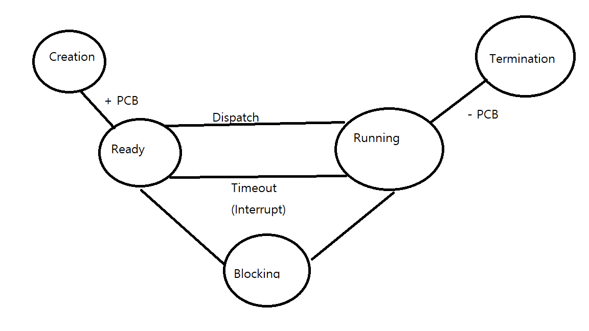
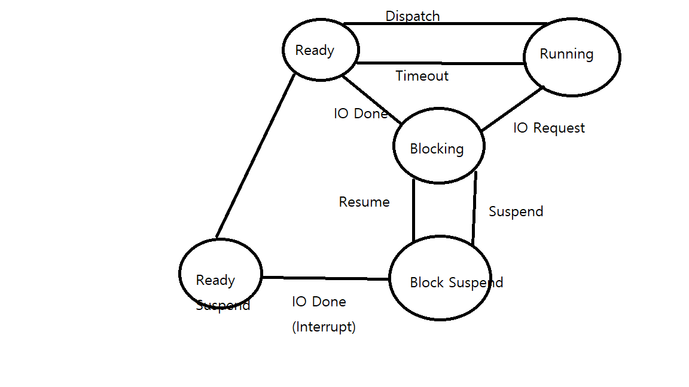

# Ch3. Process and Thread

# Section

[Process Intro](#Process-Intro)

[PCB and Context Switch](#PCB-and-Context-Switch)

[Process Calculation](#Process-Calculation)

[Thread](#Thread)

[Dynamic Allocation and System call](#Dynamic-Allocation-and-System-call)

# Goal

- Status of the process after initialization
- Understand how PCB and context switch works
- Understand process creation, copy and transformation
- Understand thread and multi-thread

# Process Intro

### What is process?

- `From CPU's perspective, a process is a unit of task`
- `When we double-click a program, program becomes a process`
- Program vs Process
    - Program: `Static state that stored in storage`
    - Process: `Dynamic state that is loaded on memory for execution`
    - `Write a program` and `Run process`
    - If code is executed, it becomes a process
    - `Program = Recipe, whereas process = food`

### How Process Works, Status of process

- A process goes through various state under OS
- Example: Restaurant
    - How restaurant operates
        - Waiter takes orders from tables, and hand it over to kitchen
            - What to order, table number, how many people, how food should be cooked, etc are
        - Then chef start cooking
    - `Cooking under batch system`
        - Only one table
        - One order only
        - Start new one only after new customer comes in
        - While customers are eating, kitchen takes rest
        - Even if restaurant takes orders in advance(Queue), it still has to wait
    - `Cooking under time-sharing system`
        - Take more than one order
        - Cooking under batch system in a Restaurant is not efficient
        - While customers are eating, kitchen has to cook for other tables
        - Under time-sharing system, chef distributes time for every order in order to serve every table
            - Equivalent to CPU allocating time for every process
        - Then how?
            - Restaurant takes `orders`
            - Kitchen allocate time for `cooking entrée for table A`
            - When it's done, `mark it as done` and place it all the way to the bottom
            - Start `cooking entrée for table B`
            - When it's done, `mark it as done`, place it all the way to the bottom
            - `Start main dishes for table A`
            - and so on ...
    - Importance of orders
        - `It contains information about`
            - How food should be cooked, current status, what to do next and etc
        - When it is done, it gets removed from orders list
- Takeaways from Restaurant Case
    - Orders listed on list = start of cooking
    - While cooking, orders go through either `stay in list` or `chef cooking` status
    - When it is done, it gets removed from the list

- Exceptions in cooking
    - In restaurant, All procedures listed above do not work smoothly
    - If vegies are not washed, then chef needs to wait to cook lo mein
    - `Waiting without cooking something else is not efficient`
    - If in case of smart chef, `put that in wait list and cook something else`
    - What if vegies are washed? Should chef stop what he/she is cooking and start cooking lo mein?
        - No, it's inefficient
        - `put that in order list from wait list`
    - What if customer want it slow?
        - Expected time of cooking can be tracked whereas customer's request is not
        - In this case, put order in `pending list`
        - `Different from wait list`
- Exceptions in Process
    - Works same as cooking
    - `It has order list, wait list, pending list and current working list`

### Program to process

- Recap
    - `Process is an unit of work called task`
    - `Orders from restaurant go through various steps or status`
- How program is transformed into process
    1. OS load program onto memory
    2. At the same time, OS creates `PCB, or order in restaurant`
        - PCB contains information needed to handle process
    3. As chef cannot cook without order, Program cannot be transformed into process without `PCB`
- Key elements in PCB
    - PID
        - Since memory has numbers of processes, it needs to identify each process
        - `PID is used to identify each process`
    - Memory information
        - CPU needs memory information to run where process is loaded
        - `PCB contains information about memory location of process, as well as limit register, bound register`
    - Medians
        - This is similar to `what has done so far` in cooking
        - Under time-sharing system, CPU changes current working process after certain time
        - `Before switching, PCB stores PC(program counter) and other registers that hold medians`
        - `When process takes CPU again, it starts from where it has left off`

- Sum up
    - In order to transform a program in to process,
        - `It has to manage PID, memory information and medians`, and the data structure that holds this is called `PCB`
    - `This also means that PCB has to be created when transforming a program into process`
    - `PCB is created in OS`
    - When a process finishes, process is removed from memory and PCB is disposed
    - `A program to process = acquiring PCB from OS`
    - `Process termination = disposing PCB`

- OS?
    - OS has to be run as a process
    - Bootstrap loads OS onto memory
    - Bootstrap starts many other OS related processes
    - `Computer thus runs kernel process and user process`

### Process Status

- Status of process changes in many reasons
- Batch system
    - One process at a time :point_right: status will be one of `create, run, terminate`
- Time-sharing(old)
    - Many process run simultaneously :point_right: more complicated

    1. Create
        - Process loaded on memory, PCB created
    2. Ready
        - Status that wait to acquire CPU
    3. Running
        - Process acquires CPU and starts running
        - Process runs for certain period of time
        - When process did not finish during that time :point_right: it goes back to ready status, wait for next turn
        - Process goes back and forth between `ready` and `running` status until it finishes
    4. Terminate
        - When process finishes its work
        - PCB is disposed

- Q: Who decides what process to execute?
    - A: `CPU Scheduler`
    - CPU scheduler sends PCB to CPU in order for process to take CPU
        - `Dispatch`: Work that changes status from `ready` to `running`
    - `CPU scheduler is involved in every status of process` to manage processes to work seamlessly

- Process selected by CPU scheduler
    - Running process status, allocated designated time to work
        - this allocated time is called `time slice or time quantum`
    - If process does not finish its work within that time span(`time slice`), this is called `timeout`
    - `timeout`?
        - From running status to ready status
    - When new process becomes a running status,
        - CPU tells clock to notify after time slice
        - After time slice, clock uses interrupt to notify CPU

### Process Status

- Creation, Ready, Running, Terminate Plus `Blocking`
- `Why adding blocking status?`
    - When a process requests IO, CPU does not retrieve data, rather IO manager takes in charge
    - While IO work is running, a process cannot proceed
    - This is also means CPU is just waiting without doing anything
    - In restaurant, this is also equivalent to `chef waiting because preps are not done`
- `Blocking Status?`
    - `Status that a process waits for IO work to be done`
    - `In this case, Process that requests IO goes into blocking status rather than staying in running status`
- What happens when a process goes into blocking status?
    - CPU takes another process from ready status and make it as running status
    - It's like a restaurant use wait-list
- What happens IO work is done?
    - Receives interrupt from IO manager
    - `Process moves from blocking status to ready status`
        - `Because another process is currently running!!!`

### Create Status

- Program loaded on memory, PCB created from OS and allocated
- Does not run immediately
- Stay in ready status and wait for its turn
- PCB also moves to ready status

### Ready Status

- `Wait for its turn in ready queue`
- Ready queue can be multiple
- CPU scheduler choose process
    - Besides, scheduler also decides how many ready queues
- dispatch(PID)
    - Work that CPU scheduler choose which PCB
    - After this, ready status to running status

### Running Status

- Process gets CPU and running
- `Number of processes goes into running status = number of CPU`
- Takes CPU only for time slice
- `If work is not done, then timeout(PID)` :point_right: `running to ready status`
- `If work finishes, then exit(PID) to terminate`
- `If work requires IO, then block(PID) while asking IO manager to perform` :point_right: blocking status
    - `CPU scheduler choose new process`

### Blocking Status

- A status that wait for IO manager to perform IO work
- Processes in blocking status are managed by queue for each IO devices
- `When IO dones, interrupt occurs, wakeup(PID) to move PCB to ready status`

### Termination Status

- Process done, PCB removed
- If process is finished by unexpected errors or bugs,
    - OS saves memory status for debugging :point_right: `core dump`

### Pause and Suspend Status

- Create, Ready, Running, Blocking, Termination are called `active status`

- Pause Status
    - Process temporarily pausing its work
    - `User data still on memory, and PCB is still valid`
    - Process can resume from where it is left off

- Suspend Status
    - Process being out from memory temporarily
    - `When does suspend status occur?`
        - When memory is full so that memory has to leave some processes
        - Program has error
        - virus
        - Long-term process
        - IO work being dealyed
    - `Most likely for the processes that decrease performance or have minimal impact when suspending`
    - Process in suspending status
        - Kicked out from memory and goes to `swap area`
        - `Swap area`
            - `A place where data kicked out of memory temporarily stays`
    - 2 types of suspending status
        - From ready status :point_right: ready suspend status
        - From blocking status :point_right: block suspend status

# PCB and Context Switch

- `Recap: What is PCB?`
    - A Data Structure that hold information for running a process
    - Every process has its own PCB

### Composition of PCB

1. Pointer
    - Stack pointer
    - `Saved when the process moves between status to retain current position of the process`
    - `Used when implementing queue in ready and blocking status`
2. Process Status
    - Current status
3. PID
    - Used to identify each process
4. Program Counter
    - Contains location of instruction to execute next
5. Priority
    - Based on priority, queues can be more than one
    - Processes with same priority are grouped
    - CPU uses priority to determine what process to move to running status
6. Registers
    - Contain registers' median for the next execution
7. Memory information
    - Location of process in memory
    - Contains limit and bound register, segmentation table, page table and etc
8. Allocated Resource
    - IO resources, open file
    - When playing music, PCB needs information about sound card
9. Accounting information
    - Account number, CPU allocated time
10. PPID and CPID
    - Parent PID and child PID

### Role of Pointer in PCB

- Blocking status contains processes that requests IO work from various devices
    - `What if we put processes which needs various types of IO work in one place?`
        - Hard to manage when interrupt occurs
- `In Blocking status, It groups processes based on same IO requests`
    - From Hard-drive, CD-ROM, LAN ...
- Processes that requests same IO are gathered in same IO queue :point_right: wait queue
    - When interrupt occurs, it finds process and removes from wait queue, move process to ready queue

- Role of Pointer
    - Contains information about
        - Parent process pointer
        - Child process pointer
        - Memory pointer
        - Allocated resource pointer

### Context Switch

- Recap of restaurant system
    - When chef finishes part of order A :point_right: he/she marks as finish :point_right: put order A into order list
      :point_right: bring order B and start cooking B
    - Switching occurs by switching orders
    - When switching, it's not just switching orders
        - It has to clean up what has done
        - It has to mark some part as finish
        - it has to bring equipments for next dish
    - Thus, `swtiching is not only switching orders, but also switching environment`

- Context switch?
    - `Process that currently takes CPU leaves and adopting new process`
    - `During context switch, context of PCB changes`
    - In case of process leaving CPU, PCB saves what has done so far
    - In case of process taking CPU, CPU is set based on this process

- Flow (Process1 with PCB1 & Process2 with PCB2)
    1. P1 takes CPU, CPU is set with PCB1, P1 to running status
    2. When timeout or interrupt occurs
        - PCB1 saves current information about P1, P1 to ready status
        - CPU is set with PCB2, P2 to running status
        - Switch from P1 to P2 :point_right: `context switch`
    3. When P2 meets timeout or interrupt
        - PCB2 saves current information about P2, P2 to ready status
        - CPU is set with PCB1, P1 to running status
        - Switch from P2 to P1 :point_right: `context switch`
    
- When does context switch occurs?
    - Varies
    - Timeout or interrupt

# Process Calculation

# Thread

# Dynamic Allocation and System call